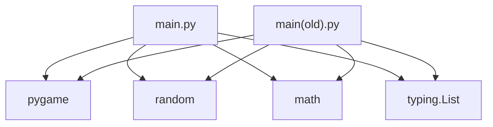
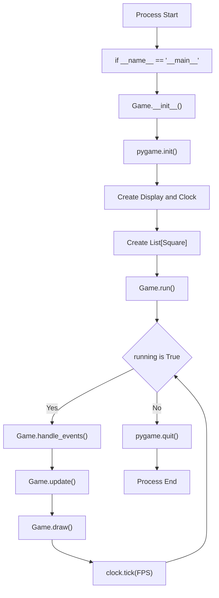
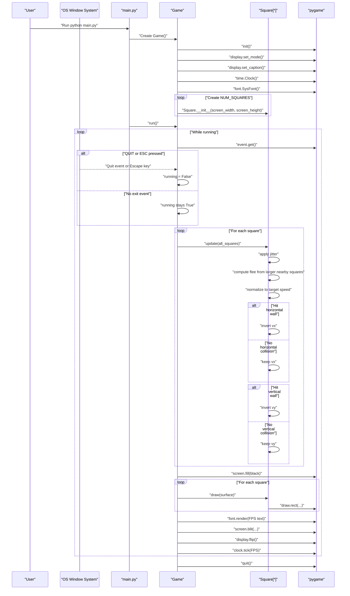

# Architecture Documentation

## Scope
This document captures the concrete architecture of the current project implementation in main.py.
The file main(old).py is present as legacy code and is not imported or executed by the current entry path.

## Source Inventory
- Runtime entry point: main.py
- Primary classes: Game, Square
- Runtime library: pygame
- Supporting libraries: random, math, typing
- Legacy snapshot: main(old).py

## Dependency Graph

Notes:
- main.py is the active module used by the program entry guard.
- main(old).py is currently disconnected from runtime execution.

## High-Level Runtime Flow

## Function-Level Call Graph

```mermaid
graph TD
    Entry["__main__ block"] --> NewGame["Game()"]
    Entry --> RunCall["Game.run()"]

    NewGame --> PyInit["pygame.init()"]
    NewGame --> SetMode["pygame.display.set_mode()"]
    NewGame --> SetCaption["pygame.display.set_caption()"]
    NewGame --> NewClock["pygame.time.Clock()"]
    NewGame --> NewFont["pygame.font.SysFont()"]
    NewGame --> BuildSquares["[Square(...) for _ in range(NUM_SQUARES)]"]

    BuildSquares --> SquareInit["Square.__init__()"]
    SquareInit --> RandSize["random.randint()"]
    SquareInit --> RandPos["random.randint()"]
    SquareInit --> RandVel["random.choice() + random.uniform()"]
    SquareInit --> RandColor["random.randint()"]

    RunCall --> HandleEvents["Game.handle_events()"]
    RunCall --> Update["Game.update()"]
    RunCall --> Draw["Game.draw()"]
    RunCall --> Tick["clock.tick(FPS)"]
    RunCall --> Quit["pygame.quit()"]

    HandleEvents --> EventGet["pygame.event.get()"]

    Update --> SquareUpdate["Square.update(all_squares)"]
    SquareUpdate --> Jitter["random.uniform()"]
    SquareUpdate --> Dist["math.sqrt()"]
    SquareUpdate --> Speed["math.hypot()"]
    SquareUpdate --> Target["Square.target_speed()"]

    Draw --> Fill["screen.fill()"]
    Draw --> SquareDraw["Square.draw(surface)"]
    Draw --> FpsRender["font.render()"]
    Draw --> Blit["screen.blit()"]
    Draw --> Flip["pygame.display.flip()"]
    SquareDraw --> DrawRect["pygame.draw.rect()"]
```

## Primary Execution Sequence

## Assumptions and Boundaries
- The architecture reflects the code currently in main.py.
- main(old).py is documented for dependency visibility but excluded from runtime flow because there is no import or call path from main.py to main(old).py.
- No external service, database, or network boundary is present in this project.
